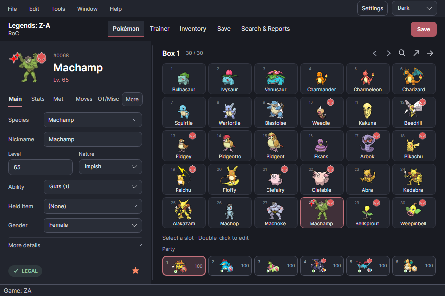
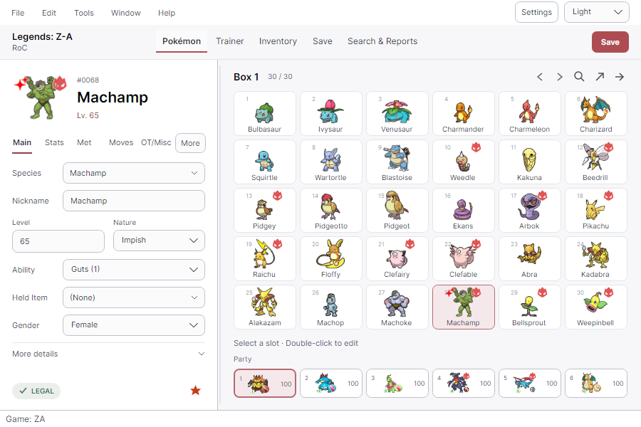
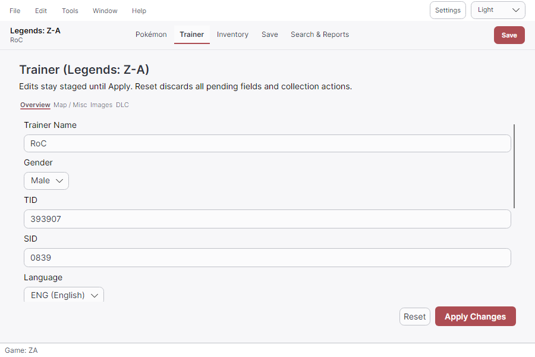
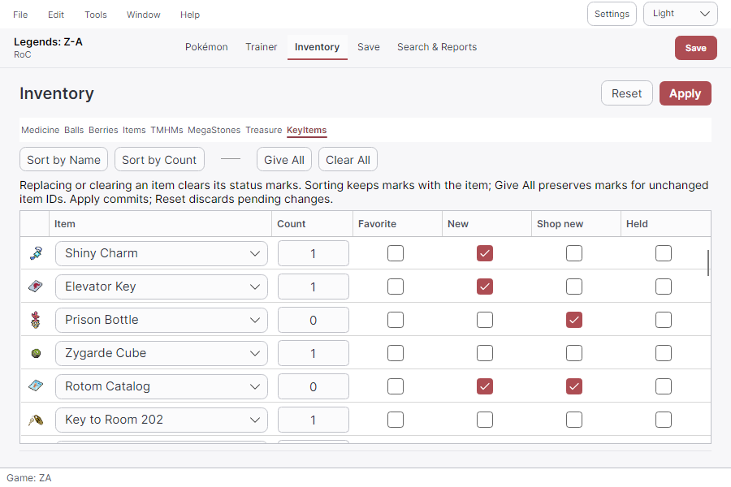
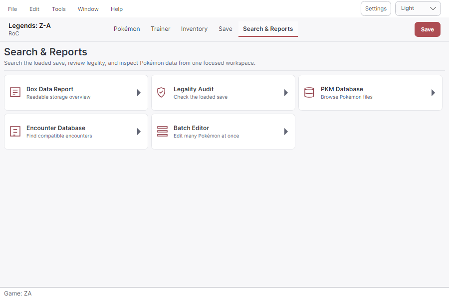
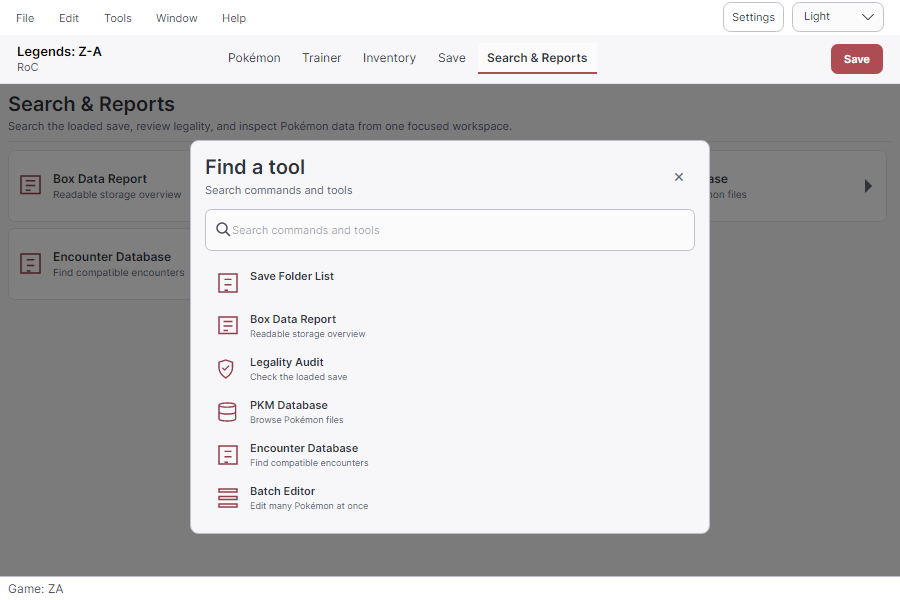

<h1 align="center">PKHeX-Avalonia</h1>

<p align="center">
  <a href="https://github.com/realgarit/PKHeX-Avalonia/releases/latest"></a>
  <a href="https://github.com/realgarit/PKHeX-Avalonia/actions/workflows/ci.yml"></a>
  <a href="LICENSE"></a>
  <a href="https://github.com/realgarit/PKHeX-Avalonia/releases"></a>
  <a href="https://discord.gg/DY2SWKsV75"></a>
</p>

<p align="center">
  A native Pokémon save editor for <strong>Windows, macOS, and Linux</strong>, built with .NET 10 and Avalonia 11 on the upstream <a href="https://github.com/kwsch/PKHeX">PKHeX</a> engine.
</p>

<p align="center">
  <a href="#download">Download</a> · <a href="#getting-started">Getting started</a> · <a href="#features">Features</a> · <a href="#screenshots">Screenshots</a> · <a href="#building-from-source">Build</a> · <a href="#community">Community</a>
</p>

<p align="center">
  <a href="docs/screenshots/pokemon-editor-dark.png"></a>
</p>

<p align="center">
  The default 900×600 workspace keeps Pokémon editing, box navigation, and the party together. Advanced fields and game-specific tools are available through <strong>More</strong>, <strong>Tools</strong>, and the searchable tool launcher.
</p>

## Download

Get a self-contained package from the [official latest release](https://github.com/realgarit/PKHeX-Avalonia/releases/latest). **No .NET installation is required to run it.**

| Platform | Portable package | Installer or app image |
|---|---|---|
| Windows x64 | `PKHeX-Avalonia-win-x64.zip` | `PKHeX-Avalonia-Setup-unsigned.exe` |
| Linux x64 | `PKHeX-Avalonia-linux-x64.zip` | `PKHeX-Avalonia-<version>-x86_64.AppImage` or `PKHeX-Avalonia-linux-x86_64.flatpak` |
| macOS Apple Silicon | `PKHeX-Avalonia-osx-arm64.zip` | `PKHeX-Avalonia-osx-arm64-selfsigned.dmg` |
| macOS Intel | `PKHeX-Avalonia-osx-x64.zip` | `PKHeX-Avalonia-osx-x64-selfsigned.dmg` |

Signing suffixes may change; always check the release's asset list. Expand your platform for setup instructions.

<details>
<summary><strong>Windows — installer or portable ZIP</strong></summary>

Run the installer, or extract the **complete** Windows ZIP before launching `PKHeX.Avalonia.exe`. Keep the extracted files together. The `unsigned` installer is not code-signed; only download it from the official release page.

See the [packaging guide](docs/packaging.md#windows-installer--code-signing) for installer and signing details.

</details>

<details>
<summary><strong>macOS — Apple Silicon or Intel</strong></summary>

Choose `osx-arm64` for Apple Silicon or `osx-x64` for Intel. Open the DMG and copy the app to Applications, or extract the ZIP. A self-signed build is not Apple-notarized and may require first-launch approval.

See [macOS signing and first launch](docs/packaging.md#macos-stable-self-signed-identity-the-tertius-pattern) for details.

</details>

<details>
<summary><strong>Linux — portable AppImage or ZIP</strong></summary>

Download the x86_64 AppImage, make that file executable, and launch it. Replace `<version>` with the downloaded release number:

```bash
chmod +x "PKHeX-Avalonia-<version>-x86_64.AppImage"
./"PKHeX-Avalonia-<version>-x86_64.AppImage"
```

Alternatively, extract the Linux ZIP and run its executable. Both packages are for **x86_64**, not ARM. The .NET runtime is bundled; Linux system libraries are still required. If FUSE is unavailable, pass `--appimage-extract-and-run` to the AppImage.

The companion `.AppImage.zsync` release file supports AppImageUpdate. See [AppImage requirements and updates](docs/packaging.md#appimage-catalog-metadata-and-updates).

**Install with one command:** on a supported x86_64 Linux desktop with Bash, `curl`, `python3`, and `sha256sum`, run:

```bash
curl -fsSL https://raw.githubusercontent.com/realgarit/PKHeX-Avalonia/main/Scripts/install.sh | bash
```

The script verifies the release's SHA-256 digest, installs a stable `~/.local/opt/PKHeX-Avalonia/PKHeX-Avalonia.AppImage`, and adds a menu entry and icon under `$XDG_DATA_HOME` (default `~/.local/share`). No root access is needed. To select a release, use `bash -s -- --version <x.y.z>` instead of `bash` at the end of the command.

When running an AppImage, **Settings → Linux desktop integration → Add to application menu** installs a copy in the same location. Launch that copy from the menu for subsequent use; the in-app updater updates the running copy. **Remove from application menu** removes only the entry and icon, keeping the executable so you can add it again.

To uninstall the installed AppImage as well as its entry and icon:

```bash
curl -fsSL https://raw.githubusercontent.com/realgarit/PKHeX-Avalonia/main/Scripts/install.sh | bash -s -- --uninstall
```

Uninstall preserves save files, settings, and backups. AppImage updates use the stable filename in the same directory; an unrelated existing file with that name is left untouched and the update stops.

</details>

<details>
<summary><strong>Linux — sandboxed Flatpak bundle</strong></summary>

Install Flatpak and your desktop's XDG portal backend, then download the x86_64 bundle from the release page:

```bash
flatpak remote-add --user --if-not-exists flathub https://dl.flathub.org/repo/flathub.flatpakrepo
flatpak install --user ./PKHeX-Avalonia-linux-x86_64.flatpak
flatpak run io.github.realgarit.PKHeX-Avalonia
```

Flathub supplies the runtime dependencies; **the app itself is not listed on Flathub**. To update this standalone bundle, download a newer release and repeat the install command. The in-app updater does not replace Flatpak files.

Use **File → Open** and **Save As** to grant access to files through the desktop portal. See the [Flatpak guide](docs/packaging.md#linux-flatpak) for file access, persistent data, and troubleshooting.

</details>

<details>
<summary><strong>Updates, signing, and package-manager availability</strong></summary>

The app checks GitHub Releases for updates and can display release notes. Use **Help → About → Check for Updates** for a manual check. Available installation actions depend on the package; Flatpak updates are managed outside the app.

The Homebrew and winget files under `packaging/` are distribution templates. They do not establish that a public package-manager listing is available. See the [packaging guide](docs/packaging.md) for signing and distribution details.

</details>

## Getting started

1. Keep an untouched backup of your exported game save.
2. Use **File → Open**, or drop the save onto the window where your desktop supports it. If a drop is ignored, use **File → Open**; Flatpak may need a portal file-access grant.
3. Select a box slot and double-click it to load its Pokémon into the editor.
4. Edit Main, Stats, Met, Moves, or OT/Misc fields. Use **More** for additional sections, then the slot's **Set** action to place the edited Pokémon back into a slot.
5. Use **File → Save As** for a separate copy, or **Save** to update the loaded file.

Pokémon-file import requires a compatible save to be open. Available fields and tools depend on the save and Pokémon format. Legality results describe the checks supported by the current engine; they do not guarantee acceptance by online services.

## Features

<a id="pokémon-and-save-editing"></a>
<details>
<summary><strong>Pokémon and save editing</strong></summary>

- Save support across Generations 1–9, including Let's Go, Legends: Arceus, BDSP, and Legends: Z-A, as supported by the bundled Core engine.
- Edit species, forms, abilities, held items, stats, IVs/EVs, moves, met data, trainer identities, ribbons, and memories where the format supports them.
- Live legality reports, derived characteristics alongside stats, numeric Met Location tooltips, and generation-aware trainer IDs.
- Box and party navigation, slot moves/copies, file drag-and-drop, and detached Box/Party windows. Undo/redo covers supported slot operations.
- Alpha, Shiny, Gigantamax, held-item, egg, legality, and storage markers where supported. Multiple states can appear together; the separate Box Viewer keeps its own box and selection.
- Pokémon-file and Showdown import/export, with format conversion where Core supports it.
- Trainer, inventory, Pokédex, batch, Hall of Fame, Secret Base, and other game-specific editors.
- Received Switch Mystery Gift records for Sword/Shield, BDSP, Legends: Arceus, and Scarlet/Violet. This edits save-side gift history; it does not deliver or redeem BCAT gifts.
- Optional **PKHaX** mode for editing beyond normal constraints. Enable it in **Settings → Editor Behavior**, then restart.

</details>

<a id="tools-for-larger-workflows"></a>
<details>
<summary><strong>Advanced workflows — databases, batch editing, Auto-Legality and LiveHeX</strong></summary>

- **PKM, Mystery Gift, and Encounter databases:** search and inspect Pokémon and encounter data.
- **Legality Audit and Box Report:** review occupied slots across a save.
- **Batch Editor:** apply instructions to multiple Pokémon.
- **Auto-Legality Mod:** generate Pokémon from Showdown sets using the bundled legalization engine. Results depend on supported encounters and constraints; generation can fail.
- **Living Dex generator:** generate entries into available box space, with progress and cancellation.
- **Backup Manager and save diff:** manage automatic backups, restore saves, and compare slot contents.
- **LiveHeX:** read and write supported running Switch games over the local network using [sys-botbase](https://github.com/olliz0r/sys-botbase). Requires a compatible console setup and game version; see the [support matrix](PKHeX.Infrastructure/LiveHex/NOTICE.LiveHeX.md).

Use **Tools**, or **Ctrl+K** to search the tool launcher. The tool catalog reflects the loaded save's capabilities. See the [feature guide](docs/features.md) for details.

</details>

<a id="desktop-experience"></a>
<details>
<summary><strong>Desktop features — themes, languages and accessibility</strong></summary>

- Light and Dark themes, switchable at runtime from the top bar or Settings.
- Ten interface languages: English, German, Spanish, French, Italian, Japanese, Korean, Simplified Chinese, Traditional Chinese, and Brazilian Portuguese (interface only; game data such as species and move names stays in English). Switch through **Help → Language**.
- Compact and comfortable density settings, a resizable shell, and Pokémon, Save, and Reports workspaces.
- Keyboard navigation, contextual accessible control names, and visible focus. See [accessibility and shortcuts](docs/accessibility.md).
- Platform-specific settings/data directories, update notifications, and release notes.

</details>

## Screenshots

Expand any section to browse the app, then click its heading again to collapse it. Click an image for the full-size capture.

<details>
<summary><strong>Pokémon editor — dark and light themes</strong></summary>

The compact editor keeps Pokémon fields, box navigation, and the party together. The selected Machamp shows Alpha and Shiny markers together in the box and editor preview.




</details>

<details>
<summary><strong>Save editing — Trainer and Inventory</strong></summary>

Trainer identity and staged actions, followed by Z-A key items with their individual artwork.




</details>

<details>
<summary><strong>Search &amp; Reports and the tool launcher</strong></summary>

Access save reports and databases, or find an available tool with Ctrl+K.




</details>

<details>
<summary><strong>BDSP editors — Pokédex and Seal Stickers</strong></summary>

Pokédex species, language, and form flags; sticker names, counts, totals, and obtained state.


</details>

<details>
<summary><strong>Technical Records</strong></summary>

Inspect record flags, current moves, and permission indicators, with staged bulk actions and Save/Cancel.


</details>

These are headless renders of the real Avalonia views, captured on 2026-10-03. The lead frames use a copy of the checked-in Z-A save, with its Alpha Machamp made Shiny in memory for the demonstration. Core legality checks remain enabled and pass. Auxiliary editors use synthetic data. No private save data was used.

The [screenshot guide](docs/screenshots/README.md) explains how to regenerate the images without opening a desktop window.

## Building from source

<details>
<summary><strong>Developers — build, run, test and publish</strong></summary>

Install the [.NET 10 SDK](https://dotnet.microsoft.com/download/dotnet/10.0) and Git:

```bash
git clone https://github.com/realgarit/PKHeX-Avalonia.git
cd PKHeX-Avalonia
dotnet restore PKHeX.sln
dotnet build PKHeX.sln -c Release
dotnet run --project PKHeX.Avalonia/PKHeX.Avalonia.csproj -c Release --no-build
```

Run tests after building:

```bash
dotnet test PKHeX.sln -c Release --no-build
```

Publish a self-contained build, for example Windows x64:

```bash
dotnet publish PKHeX.Avalonia/PKHeX.Avalonia.csproj -c Release -r win-x64 --self-contained true -o artifacts/win-x64
```

Other release targets are `linux-x64`, `osx-arm64`, and `osx-x64`. Installers, DMGs, and AppImages require the additional steps in the [packaging guide](docs/packaging.md).

</details>

## Project structure and contributing

<details>
<summary><strong>Contributors — architecture and contribution rules</strong></summary>

| Project | Responsibility | Project dependencies |
|---|---|---|
| `PKHeX.Core` | Upstream save, Pokémon, encounter, and legality logic; mirrored byte-for-byte | None |
| `PKHeX.Application` | Framework-independent use cases and interfaces | Core |
| `PKHeX.Infrastructure` | Files, settings, backups, updates, legalization, LiveHeX | Application, Core, AutoMod |
| `PKHeX.Presentation` | ViewModels and localization; no Avalonia dependency | Application, Core |
| `PKHeX.Avalonia` | Desktop host, composition root, views, controls, themes | Core, Application, Infrastructure, Presentation |
| `PKHeX.AutoMod` | Vendored Auto-Legality Mod engine | Core |

Tests cover Core behavior, Avalonia controls/ViewModels, headless rendering, and architecture boundaries. CI builds and tests on Windows, macOS, and Linux.

Development is AI-assisted. Shared repository instructions are in [AGENTS.md](AGENTS.md). Contributions go through branches and pull requests. Keep consumer changes outside the Core mirror, add user-facing strings to all ten language resources, and include relevant regression coverage. CI owns the application version bump; do not edit `UIVersion` in a PR.

Start with [CONTRIBUTING.md](CONTRIBUTING.md) and the [development guide](docs/development.md).

</details>

## Community

Join the [PKHeX-Avalonia Discord](https://discord.gg/DY2SWKsV75) for support, testing, and feedback, or [open a GitHub issue](https://github.com/realgarit/PKHeX-Avalonia/issues).

Include the app version, operating system, game/save format, reproduction steps, and expected versus actual behavior in bug reports. Screenshots help explain UI problems. Avoid posting private save files or trainer information publicly.

## Documentation

- [Feature guide](docs/features.md): editing workflows, Auto-Legality Mod, Living Dex, LiveHeX, backups, and updates.
- [Development guide](docs/development.md): architecture, builds, tests, upstream synchronization, and releases.
- [Accessibility](docs/accessibility.md): keyboard shortcuts and screen-reader notes.
- [Packaging](docs/packaging.md): platform artifacts, installers, and signing.
- [Screenshot generation](docs/screenshots/README.md): reproducible headless captures.
- [Documentation index](docs/README.md): all project guides.

## Credits and license

Built on the work of the [PKHeX team](https://github.com/kwsch/PKHeX) and its research contributors.

- **Save and legality engine:** [PKHeX](https://github.com/kwsch/PKHeX).
- **Auto-Legality Mod:** [PKHeX-Plugins](https://github.com/santacrab2/PKHeX-Plugins), by architdate, santacrab2, and contributors. See the [vendoring notice](PKHeX.AutoMod/VENDORED.md).
- **UI framework:** [Avalonia](https://github.com/AvaloniaUI/Avalonia).
- **LiveHeX protocol:** [sys-botbase](https://github.com/olliz0r/sys-botbase), by olliz0r.
- **QR codes:** [QRCoder](https://github.com/codebude/QRCoder).
- **Sprites:** [pokesprite](https://github.com/msikma/pokesprite), plus the National Pokédex Icon Dex project and contributors for Arceus sprites.

Distributed under [GNU GPL v3](LICENSE). Third-party components retain their respective licenses and notices. Pokémon names and artwork belong to their respective owners.
